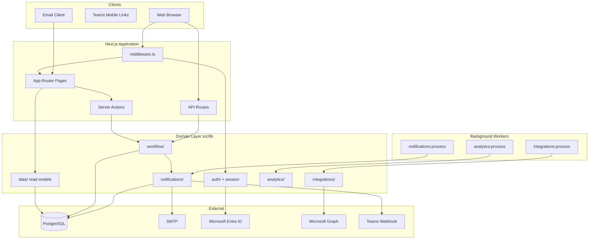
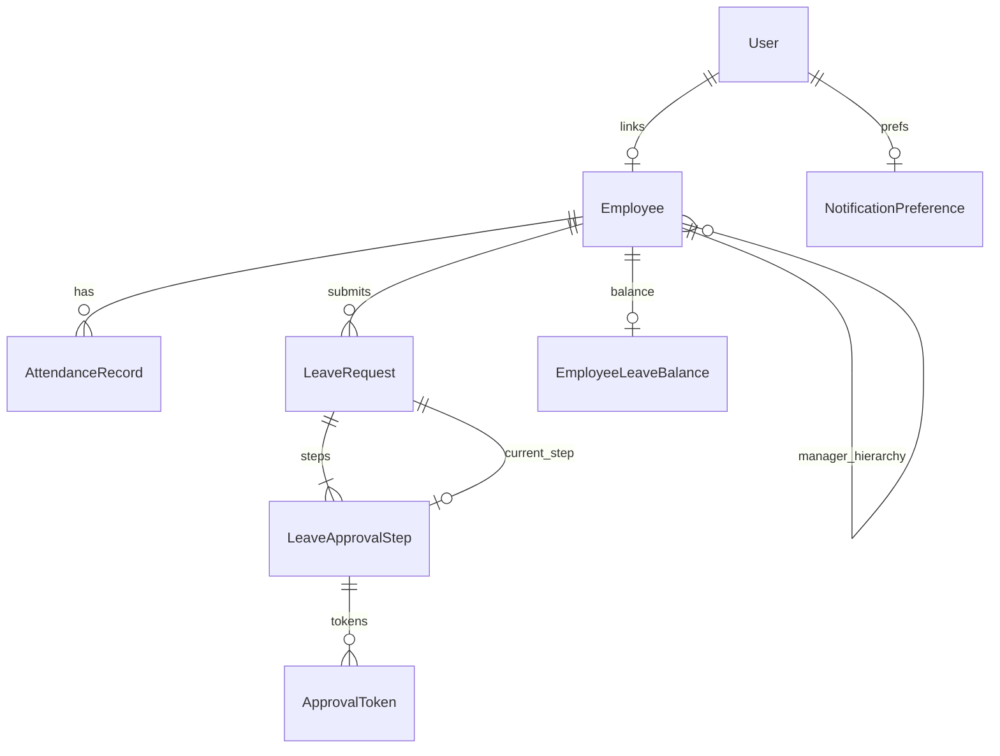
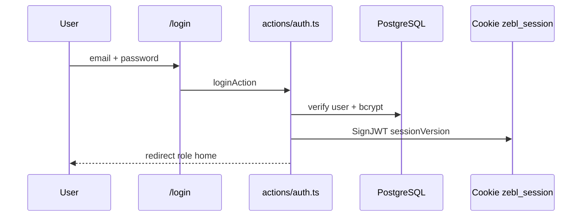
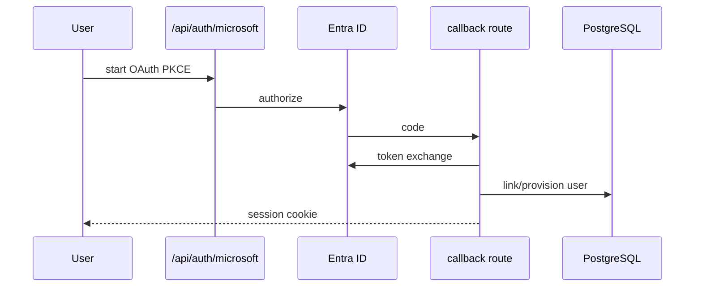
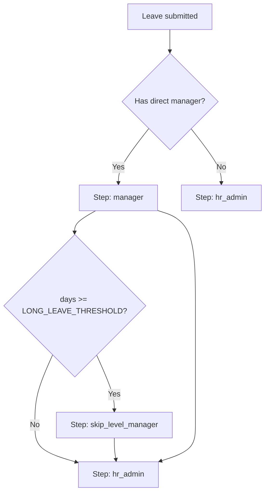
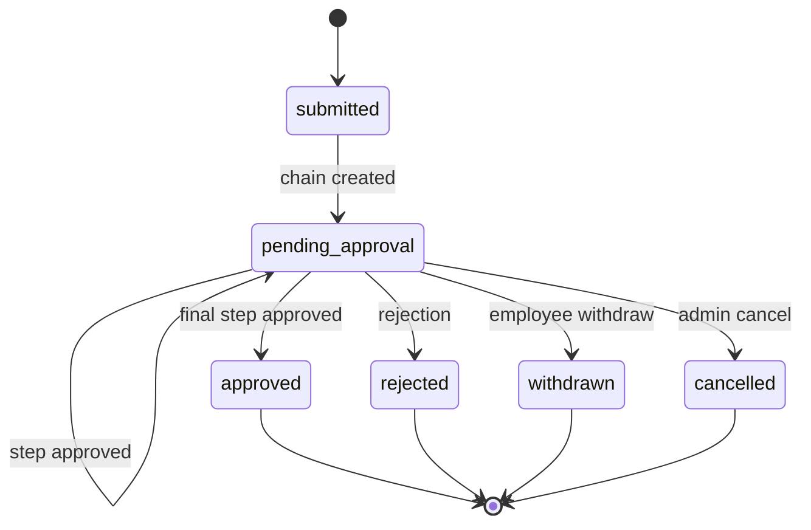
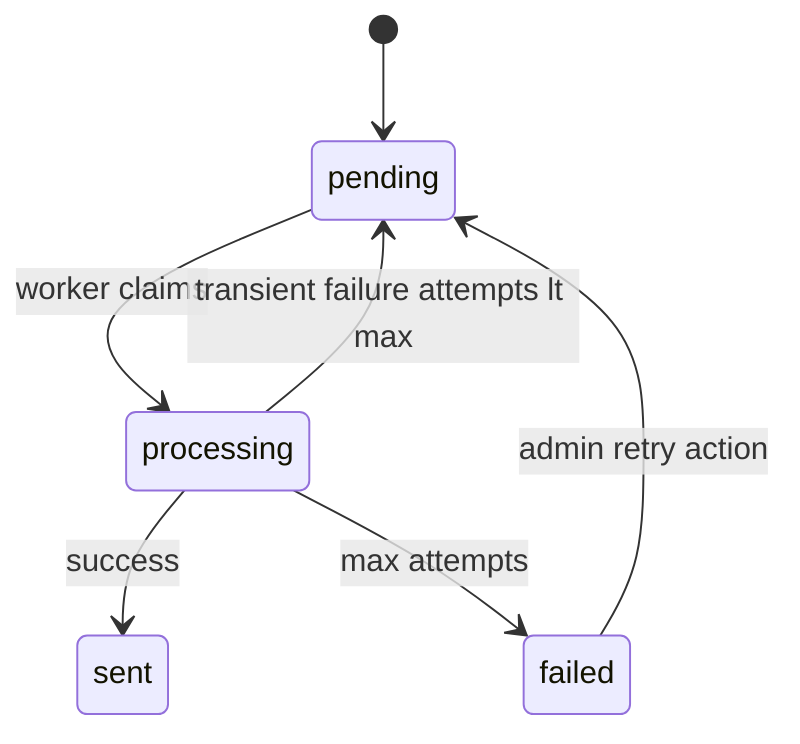
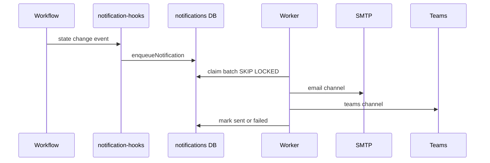
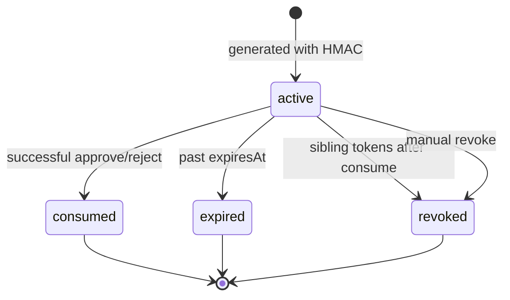
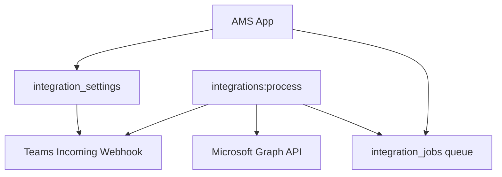

# AMS Engineering Review

**Project:** Zebl Attendance Manager (AMS)  
**Document version:** 1.0  
**Review date:** May 2026  
**Scope:** Full-stack internal HR platform — attendance, leave workflow, notifications, Microsoft integrations, analytics

This document is the primary technical reference for developers, technical leads, and maintainers. It reflects the **actual implemented codebase** after P0 (hardening), P1 (operational readiness), P2 (workflow UX), and P3 (maintainability) sprints — not aspirational architecture.

---

## Table of contents

1. [Executive Summary](#1-executive-summary)
2. [Current Architecture Overview](#2-current-architecture-overview)
3. [Database Architecture](#3-database-architecture)
4. [Authentication & RBAC](#4-authentication--rbac)
5. [Leave Workflow Engine](#5-leave-workflow-engine)
6. [Notification Architecture](#6-notification-architecture)
7. [Email Approval System](#7-email-approval-system)
8. [Microsoft & Teams Integration](#8-microsoft--teams-integration)
9. [Analytics & Workforce Intelligence](#9-analytics--workforce-intelligence)
10. [Security Review](#10-security-review)
11. [Operational Readiness Review](#11-operational-readiness-review)
12. [Testing Strategy](#12-testing-strategy)
13. [Technical Debt Review](#13-technical-debt-review)
14. [UX & Workflow Evaluation](#14-ux--workflow-evaluation)
15. [Production Readiness Classification](#15-production-readiness-classification)
16. [Recommended Roadmap](#16-recommended-roadmap)
17. [Deployment Guide](#17-deployment-guide)
18. [Appendix](#18-appendix)

---

## 1. Executive Summary

### Tech stack (actual)

| Layer | Technology |
|-------|------------|
| Application | Next.js 15 (App Router), React 19, TypeScript 5.8 |
| Styling | Tailwind CSS 4, Radix UI primitives, custom components |
| ORM / DB | Prisma 6.8, **PostgreSQL** (required) |
| Auth | JWT cookies (`jose`), bcrypt (local), OpenID Connect (Microsoft Entra) |
| Email | Nodemailer + React Email templates |
| Background work | Node `tsx` scripts + HTTP cron endpoints |
| Testing | Vitest 3 (31 tests: 10 unit files + 1 integration) |
| Validation | Zod (bulk actions; pattern extensible) |

### Architecture type

**Modular monolith** — single Next.js deployable with domain-organized `src/lib` modules, server actions for mutations, API routes for workers/webhooks/health, and separate CLI worker processes.

### Current maturity level

| Dimension | Assessment |
|-----------|------------|
| Core leave workflow | Mature for internal use |
| Attendance upload | Functional, Excel-dependent |
| Notifications | Production-capable with external cron |
| Integrations | Optional, configuration-heavy |
| Analytics | Rule-based reporting, not ML |
| Test coverage | Thin — critical paths only |
| Documentation | Good after P3 doc sprint |

**Overall:** **Internal-use ready** with operational discipline. Not yet **enterprise-ready** for multi-tenant, high-availability, or compliance-heavy deployments without further hardening.

### Operational readiness

- PostgreSQL required; Docker Compose provided for local dev
- Health endpoints (`/api/health`, `/api/health/deep`)
- Worker heartbeats, queue depth monitoring, admin operations UI
- Phase migration scripts (3–7) + `db:validate`
- **Requires scheduled workers** — notifications, integrations, analytics do not run inside the Next.js process by default

### Key strengths

1. **Transactional leave workflow** with optimistic concurrency (`version` field)
2. **Single-transaction email approval** — token consume + workflow advance + sibling revoke (P0 fix)
3. **Clear RBAC** and role-scoped shells (admin/hr_admin, manager, employee)
4. **Audit logging** on sensitive operations
5. **HR command center** — action-oriented ops dashboard (P2)
6. **Centralized read layer** (`src/lib/data/`) and module boundaries (P3)
7. **Queue locking** with `FOR UPDATE SKIP LOCKED` on PostgreSQL (P1)

### Major risks (honest)

1. **In-memory rate limits and session-version cache** — not safe for horizontal scale without Redis/sticky sessions
2. **`xlsx` dependency** — known high-severity advisories; no drop-in fix
3. **No E2E test suite** — regressions possible in UI and full approval flows
4. **Prisma calls still present in some components** — architectural drift risk
5. **Migration history** — legacy SQLite SQL + phase scripts; consolidation incomplete
6. **Analytics labeled as intelligence** — threshold rules only; can mislead stakeholders if oversold

---

## 2. Current Architecture Overview

### System context



### App Router structure

```
src/app/
├── (dashboard)/          # Authenticated shells
│   ├── admin/            # admin + hr_admin
│   ├── manager/
│   └── employee/
├── approve/[token]/      # Public email approval UI
├── login/
├── api/
│   ├── auth/microsoft/   # OAuth start + callback
│   ├── approve/[token]/  # Token consume API
│   ├── leaves/           # Workflow REST helpers
│   ├── notifications/    # process + center
│   ├── integrations/     # process + Teams callback
│   ├── analytics/        # dashboard, export, process
│   ├── health/           # liveness + deep
│   └── search/           # global command palette API
└── layout.tsx, globals.css
```

### Layered module design (post-P3)

| Layer | Responsibility | Location |
|-------|----------------|----------|
| UI | Presentation, forms, tables | `src/components/` |
| Routes | Composition, searchParams | `src/app/` |
| Mutations | FormData actions, revalidation | `src/actions/` |
| Read models | Prisma reads, pagination | `src/lib/data/` |
| Domain services | Workflow, leave balances, org | `src/lib/workflow/`, `leave.ts`, `org.ts` |
| Infrastructure | Prisma client, config, errors | `prisma/`, `lib/config/`, `lib/errors/` |

`src/lib/queries.ts` re-exports `@/lib/data` — **deprecated**; new code should import from `@/lib/data`.

### Subsystem relationships

```mermaid
flowchart LR
  LeaveApply[Employee applies leave] --> WF[leave-workflow.ts]
  WF --> Steps[LeaveApprovalStep chain]
  WF --> Tokens[ApprovalToken generator]
  WF --> Hooks[notification-hooks]
  Hooks --> Queue[notifications table]
  Queue --> Worker[notifications:process]
  Worker --> Email[SMTP]
  Worker --> Teams[Teams webhook]
  Tokens --> EmailLink[/approve/token]
  EmailLink --> Consumer[token-consumer.ts]
  Consumer --> WF
  WF --> Audit[audit_logs]
  WF --> Calendar[integration_jobs calendar sync]
```

### Authentication system

- JWT in HTTP-only cookie (`zebl_session`), 7-day expiry
- Session payload includes `sessionVersion` for invalidation
- Microsoft SSO via PKCE (`openid-client`)
- Guards: `auth-guards.ts` + middleware route prefixes

### Workflow engine

Single source of truth: `src/lib/workflow/leave-workflow.ts` — all status transitions, balance deduction, step advancement.

### Notification system

Enqueue on workflow events → `notifications` table → worker batch dispatch → email/Teams channels.

### Microsoft integrations

Optional: Entra SSO, Graph calendar sync, org sync, Teams incoming webhook. Controlled via `integration_settings` + env vars.

### Analytics system

Scheduled aggregation → `workforce_metrics`, `analytics_snapshots`, `anomaly_detections` — **deterministic rules**, not AI.

---

## 3. Database Architecture

### Prisma overview

- **Provider:** `postgresql` only (`prisma/schema.prisma`)
- **~20 models** spanning HR core, workflow, notifications, integrations, analytics, audit
- **Legacy field:** `LeaveRequest.status` (enum) coexists with `workflowStatus` — display mapping via `workflow-status.ts`

### Core entities

| Model | Purpose |
|-------|---------|
| `User` | Login identity, role, `sessionVersion`, optional `employeeId` |
| `Employee` | Workforce record, manager hierarchy, presence cache |
| `AttendanceRecord` | Daily attendance facts (unique per employee+date) |
| `AttendanceUpload` | Excel import batch metadata |
| `LeaveRequest` | Leave application + workflow state + calendar sync fields |
| `EmployeeLeaveBalance` | EL/CL/SL balances |
| `LeaveTransaction` | Balance adjustment history |
| `Holiday` | Org holiday calendar |

### Workflow tables

| Model | Purpose |
|-------|---------|
| `LeaveApprovalStep` | Ordered approvers (manager, skip-level, hr_admin) |
| `ApprovalToken` | HMAC-signed email approval links |
| `WorkflowEscalation` | Escalation reminder deduplication |

### Notification tables

| Model | Purpose |
|-------|---------|
| `Notification` | Outbound queue (email/teams), locking columns |
| `NotificationPreference` | Per-user channel toggles |

### Integration & worker tables

| Model | Purpose |
|-------|---------|
| `IntegrationSettings` | Singleton config (webhook, escalation hours, toggles) |
| `IntegrationJob` | Calendar sync, org sync, escalation scan jobs |
| `WorkerHeartbeat` | Last run status per worker name |

### Analytics tables

| Model | Purpose |
|-------|---------|
| `WorkforceMetric` | Aggregated KPIs by scope/period |
| `AnalyticsSnapshot` | JSON executive summary payloads |
| `AnomalyDetection` | Rule-triggered flags with severity |

### Entity relationship (simplified)



### Indexing strategy (implemented)

| Table | Indexes | Rationale |
|-------|---------|-----------|
| `leave_requests` | `workflowStatus`, `(employeeId, workflowStatus)` | Inbox filters, dashboards |
| `leave_approval_steps` | `(approverId, status)`, `leaveRequestId` | Manager pending count |
| `approval_tokens` | `tokenHash`, `expiresAt`, `(leaveRequestId, approvalStepId)` | Lookup + cleanup |
| `notifications` | `(status, scheduledAt)`, `(status, lockedAt)` | Worker dequeue |
| `audit_logs` | `createdAt`, `entityType+entityId`, `action` | Admin search |
| `attendance_records` | `attendanceDate`, unique `(employeeId, attendanceDate)` | Range queries |

### PostgreSQL migration readiness

| Status | Detail |
|--------|--------|
| **Complete (P1)** | Prisma provider = PostgreSQL; config rejects `file:` URLs |
| **Queue locking** | `FOR UPDATE SKIP LOCKED` in `queue-lock.ts` |
| **Remaining** | Legacy `prisma/migrations/*.sql` from SQLite era not fully consolidated into one migration history |
| **ETL** | `db:migrate-postgres-check` script exists; automated SQLite→PG data migration is manual |

### SQLite limitations (historical)

AMS **no longer runs on SQLite**. Historical phase scripts were rewritten to use `information_schema` (P1). Do not point `DATABASE_URL` at SQLite — `validateApplicationConfig()` will fail in production.

---

## 4. Authentication & RBAC

### Local auth flow



### Microsoft SSO flow



Configuration: `AZURE_AD_*` env vars, optional `AZURE_AD_GROUP_ROLE_MAP` / `APP_ROLE_MAP` for role assignment.

### JWT / session architecture

| Property | Value |
|----------|-------|
| Algorithm | HS256 |
| Secret | `AUTH_SECRET` |
| Cookie | `zebl_session`, path `/` |
| TTL | 7 days |
| Payload | `id`, `email`, `role`, `employeeId`, `employeeName`, `sessionVersion`, `authProvider` |

**Session invalidation:** `sessionVersion` incremented on logout; middleware checks in-memory cache (`session-version-cache.ts`, 60s TTL).

### Middleware behavior

| Path pattern | Behavior |
|--------------|----------|
| `/`, static assets | Bypass or redirect |
| Public (`/login`, `/approve`, OAuth) | Allow; redirect logged-in users away except approval paths |
| `/admin/*` | Requires `canAccessAdmin` |
| `/manager/*` | Requires `manager` role |
| `/employee/*` | Requires `employee` role |
| Stale session | Clear cookie → `/login` (except approval public paths) |

### Role hierarchy

| Role | Shell | Primary capabilities |
|------|-------|------------------------|
| `admin` | Admin | Full HR, settings, audit, operations, analytics |
| `hr_admin` | Admin | Same shell as admin (HR operations) |
| `manager` | Manager | Team approvals, manager dashboard |
| `employee` | Employee | Self-service attendance, leave apply |

### Permission system (`permissions.ts`)

| Capability | Roles |
|------------|-------|
| `canAccessAdmin` | admin, hr_admin |
| `canManageEmployee` | admin, hr_admin |
| `canApproveLeave` | admin, hr_admin, manager |
| `canAccessManagerShell` | manager only |
| `canAccessEmployeeShell` | employee only |

Server actions use `auth-guards.ts` (`requireAdminSession`, `requireApproveLeaveSession`, etc.).

### Security boundaries

- **Workflow mutations** never trust client role alone — `canUserApproveStep()` validates approver identity against step
- **Admin APIs** — deep health requires cron secret
- **Approval tokens** — independent of session cookie

### Known auth limitations

1. Session version cache is **per-process** — multi-instance deploys need sticky sessions or shared cache
2. JWT cannot be revoked instantly without DB round-trip (cache mitigates partially)
3. `hr_admin` vs `admin` distinction is minimal in UI — both use admin shell
4. SSO auto-provision policies require careful Azure configuration to avoid privilege sprawl

---

## 5. Leave Workflow Engine

### Architecture

| Module | Role |
|--------|------|
| `leave-workflow.ts` | State machine, transactions, balance side effects |
| `approval-routing.ts` | Builds approval chain from org hierarchy |
| `workflow-status.ts` | Labels, terminal states, legacy status mapping |
| `pending-approvals.ts` | Manager/HR inbox queries |
| `workflow-sla.ts` | SLA % from escalation hours |
| `leave-overlap.ts` | Team/employee overlap warnings (P2) |
| `notification-hooks.ts` | Enqueue on transitions |

### Approval chain policy (actual)



- `LONG_LEAVE_THRESHOLD_DAYS` defined in `workflow-types.ts`
- HR step always present (`approverId: null`, role `hr_admin`)
- Admin users can approve any pending step; managers only their assigned step

### Workflow state machine



### Escalation behavior

- `integration_settings.escalation_hours` (default 24) drives SLA UI and escalation worker
- `WorkflowEscalation` prevents duplicate escalation notifications per step
- Escalation processed via `integrations:process` job queue

### Cancellation / withdrawal

| Action | Actor | Requirements |
|--------|-------|----------------|
| Withdraw | Employee (own request) | Active workflow only |
| Cancel | Admin/HR | Active workflow + minimum reason length |
| Reject | Approver | Minimum comment length |

Balance restoration on cancel/withdraw handled in workflow module.

### Audit logging

`writeAuditLog()` records leave submissions, approvals, rejections, bulk operations, settings changes. Searchable at `/admin/audit`.

### Concurrency considerations

- Every mutation accepts `expectedVersion` on `LeaveRequest.version`
- `assertVersion()` inside transactions throws `WorkflowError` on mismatch
- Bulk approve catches per-item failures without aborting entire batch (max 25)
- Email approval uses same version from token row snapshot

---

## 6. Notification Architecture

### Notification engine

| Stage | Implementation |
|-------|----------------|
| Trigger | `emitWorkflowNotification()` from workflow hooks |
| Enqueue | `enqueueNotification()` → `notifications` row |
| Dedup | In-memory rate limit per type+recipient+correlationId (60s window) |
| Process | `notifications:process` worker or `POST /api/notifications/process` |
| Dispatch | `notification-dispatcher.ts` → channel adapters |
| Templates | React Email in `src/emails/` |

### Queue system

| Field | Purpose |
|-------|---------|
| `status` | pending → processing → sent / failed |
| `attempts` | Retry counter (max in `notification-types.ts`) |
| `lockedAt` / `lockedBy` | Worker claim |
| `correlationId` | Trace workflow event |
| `scheduledAt` | Deferred delivery |

PostgreSQL claiming: `claimNotificationBatch()` with `FOR UPDATE SKIP LOCKED` (P1).

### Email delivery

- Nodemailer via SMTP env vars
- Deep health warns if SMTP not configured
- Failures increment `attempts`, store `lastError`

### Teams notifications

- Incoming webhook URL from env or `integration_settings`
- `isTeamsIntegrationEnabled()` requires non-empty webhook (P0 fix — removed always-true bypass)
- Adaptive cards for approval-required events when enabled

### Retry behavior



Stuck `processing` rows released after 15 minutes (`STUCK_PROCESSING_MS`).

### Dead-letter handling

- Status `failed` after max attempts
- HR command center surfaces failed notification count
- Admin retry from `/admin/notifications`

### Worker architecture

| Worker | Script | HTTP trigger |
|--------|--------|--------------|
| Notifications | `npm run notifications:process` | `POST /api/notifications/process` |
| Integrations | `npm run integrations:process` | `POST /api/integrations/process` |
| Analytics | `npm run analytics:process` | `POST /api/analytics/process` |

`worker-manager.ts` records heartbeats in `worker_heartbeats`. Admin visibility at `/admin/operations`.

### Event flow



---

## 7. Email Approval System

### Approval token lifecycle



| Field | Purpose |
|-------|---------|
| `tokenHash` | Stored hash of signed token (unique) |
| `approvalStepId` | Binds token to specific step |
| `action` | `approve` or `reject` |
| `expiresAt` | TTL from `APPROVAL_TOKEN_TTL_HOURS` (default 72) |

### Public approval routes

| Route | Auth |
|-------|------|
| `/approve/[token]` | Public UI (middleware exempt for logged-in redirect) |
| `POST /api/approve/[token]` | Public API, rate limited |

Listed in `public-routes.ts` as `APPROVAL_PUBLIC_PATHS`.

### Replay protection

1. **Optimistic lock:** `updateMany` where `status=active` AND `usedAt=null` — count must be 1
2. **Single transaction** with workflow advance (P0)
3. **Sibling revoke** after successful consume
4. **Rate limit:** 15 attempts per 10 minutes per IP+token prefix (`rate-limit.ts`)

### Token invalidation

- Consumed tokens cannot be reused
- Step change revokes outstanding tokens (`revokeTokensForStep`)
- Workflow rejection/approval completes chain

### Security model

| Control | Status |
|---------|--------|
| HMAC signing | `APPROVAL_TOKEN_SECRET` or `AUTH_SECRET` fallback |
| Timing-safe compare | In `token-validator.ts` (tested) |
| Approver resolution | Token → `approverUserId` → `toWorkflowActor()` |
| Workflow permission | Same `canUserApproveStep()` as in-app |

### Previously identified bugs and fixes

| Bug (pre-P0) | Fix (actual) |
|--------------|--------------|
| Token marked consumed before workflow succeeded | Single `prisma.$transaction`: consume → `advanceWorkflow`/`rejectWorkflow` with `tx` → revoke siblings; rollback restores `active` on failure |
| Logged-in users blocked from `/approve/*` | Middleware exempts approval public paths from authenticated redirect |
| Teams always sent | `isTeamsIntegrationEnabled()` checks webhook URL truthfully |

### Remaining risks

1. Token links forwarded in email remain shareable until consumed — approver identity is validated but **link leakage** is a social engineering risk
2. No device binding or step-up MFA on email approval
3. Public routes depend on token secrecy — rotate `APPROVAL_TOKEN_SECRET` if compromised

---

## 8. Microsoft & Teams Integration

### Entra ID integration

- OAuth 2.0 authorization code + PKCE
- User fields: `azureOid`, `microsoftTenantId`, `authProvider`
- Optional auto-link and auto-provision (`AUTH_SSO_AUTO_*`)

### Graph API architecture

```
src/lib/microsoft/
├── graph-client.ts      # Token + request wrapper
├── graph-users.ts       # User lookup
├── graph-calendar.ts    # Calendar CRUD
└── org-sync.ts          # Manager/department sync
```

Calendar mapping: `src/lib/calendar/calendar-mapper.ts`, `calendar-events.ts`.

### Teams notifications

- **Not** Microsoft Bot Framework — **Incoming Webhook** only
- URL from `TEAMS_WEBHOOK_URL` or HR settings form
- Callback route: `/api/integrations/teams/callback` (public prefix)

### Calendar sync

- On leave approval, integration job enqueued
- `LeaveRequest.externalCalendarEventId`, `calendarSyncStatus`
- Processed by integrations worker

### Org sync

- Toggle: `org_sync_enabled` in settings
- Policy JSON in `org_sync_policy` — requires operational review before enable

### Integration architecture



### Required Azure configuration

| Item | Env var |
|------|---------|
| App registration | `AZURE_AD_CLIENT_ID`, `SECRET`, `TENANT_ID` |
| Redirect URI | `AZURE_AD_REDIRECT_URI` |
| API permissions | User.Read, Calendars.ReadWrite (calendar), GroupMember.Read.All (optional maps) |
| Graph app access | `GRAPH_CLIENT_ID`, `GRAPH_CLIENT_SECRET` if separate |

### Operational dependencies

- Valid tenant admin consent
- `APP_BASE_URL` must match production URL for OAuth and email links
- Workers must run for calendar sync and escalation — **not synchronous in request path**

---

## 9. Analytics & Workforce Intelligence

### Honest assessment

AMS analytics is **rule-based workforce reporting**. It does **not** use machine learning, LLMs, or predictive models. Terms like "anomaly detection" refer to **threshold comparisons** (e.g., absenteeism % vs prior 30-day window).

### Analytics architecture

```mermaid
flowchart LR
  Trigger[analytics:process] --> Engine[analytics-engine.ts]
  Engine --> Metrics[workforce_metrics]
  Engine --> Anomalies[anomaly_detections]
  Engine --> Snap[analytics_snapshots]
  Engine --> Notify[analytics-notifications]
  UI[/admin/analytics] --> API[/api/analytics/dashboard]
```

| Module | Function |
|--------|----------|
| `workforce-metrics.ts` | Org/dept/manager KPI persistence |
| `attendance-insights.ts` | Attendance aggregates |
| `leave-insights.ts` | Leave patterns |
| `anomaly-detection.ts` | Threshold rules (absenteeism spike, short hours rate, etc.) |
| `recommendations.ts` | Template-based suggestions from anomalies |
| `report-generator.ts` | PDF/Excel export |

### Anomaly detection logic (actual)

- Per-employee loop over active employees
- Compares recent window vs prior 30 days
- Thresholds in `DEFAULT_ANOMALY_THRESHOLDS` (`analytics-types.ts`)
- Severities: `low`, `medium`, `high` based on fixed cutoffs

### Metrics engine

- Scopes: `organization`, `department`, `team`, `employee`
- Periods: `daily`, `weekly`, `monthly`
- Stored in `workforce_metrics` with composite unique key

### Reporting system

- `GET /api/analytics/export` — admin export
- Executive snapshot JSON in `analytics_snapshots`

### Dashboard architecture

- Admin page: `/admin/analytics`
- API: `/api/analytics/dashboard`, `/api/analytics/approval-insights`
- Charts via `components/analytics/*`

### Stakeholder guidance

Do not market this subsystem as AI. Document that insights are **operational heuristics** suitable for HR review, not automated decisions.

---

## 10. Security Review

### Classification legend

| Class | Meaning |
|-------|---------|
| **Resolved** | Fixed and covered by tests or code review |
| **Remaining** | Known gap, acceptable with mitigations |
| **Blocker** | Must fix before untrusted/multi-tenant production |

### Authentication risks

| Risk | Status | Notes |
|------|--------|-------|
| Session fixation | Remaining | Standard cookie flags; review `Secure`/`SameSite` in production |
| Brute force login | Remaining | In-memory rate limit — single instance only |
| Stale JWT after logout | Resolved | `sessionVersion` + middleware cache |
| SSO misconfiguration | Remaining | Operational — group/role maps |

### Workflow risks

| Risk | Status | Notes |
|------|--------|-------|
| Concurrent approval race | Resolved | `version` optimistic locking |
| Self-approval | Resolved | `canUserApproveStep` blocks self |
| Admin bypass of chain | Remaining | By design — admin can approve any step |

### Approval token risks

| Risk | Status | Notes |
|------|--------|-------|
| Consume-before-workflow | Resolved | P0 transaction |
| Double consume | Resolved | `updateMany` count check |
| Token brute force | Remaining | Rate limit in-memory; use WAF at edge |

### Middleware limitations

| Limitation | Impact |
|------------|--------|
| No CSRF tokens on server actions | Next.js SameSite cookies mitigate partially |
| API routes vary in error handler adoption | Partial migration to `withAuthenticatedApi` |
| Health deep endpoint | Requires cron secret — good, but must not leak secret |

### RBAC boundaries

- Enforced in middleware (route prefix) and action guards
- **Gap:** Direct API access to some leave routes — must validate session + permission in each handler

### Rate limiting

| Use case | Implementation |
|----------|----------------|
| Login | `rate-limit.ts` |
| Email approval | Per-IP+token prefix |
| Notification enqueue | Per-type+recipient in-memory |

**Blocker for multi-instance:** All in-memory — **Remaining**

### Auditability

| Event | Logged |
|-------|--------|
| Leave workflow | Yes |
| Bulk ops | Yes |
| Notifications | Queue + delivery |
| Settings | Yes |
| Auth logout | Session invalidation |

### Production blockers (external/multi-tenant)

1. Shared rate-limit/session cache
2. `xlsx` vulnerability acceptance or replacement
3. E2E security tests for approval links
4. Formal CSRF policy for high-risk mutations

---

## 11. Operational Readiness Review

### Worker requirements

| Process | Frequency (recommended) | Command |
|---------|-------------------------|---------|
| Notifications | Every 1–5 min | `npm run notifications:process` |
| Integrations | Every 5–15 min | `npm run integrations:process` |
| Analytics | Daily | `npm run analytics:process` |

Optional loop mode: `WORKER_LOOP=true`, `WORKER_INTERVAL_MS=30000`.

### Cron requirements

HTTP alternative with Bearer secrets:

- `NOTIFICATION_CRON_SECRET` → `POST /api/notifications/process`
- `INTEGRATION_CRON_SECRET` → `POST /api/integrations/process`
- `ANALYTICS_CRON_SECRET` → `POST /api/analytics/process`

### Deployment assumptions

- Single or few Node processes behind reverse proxy
- PostgreSQL reachable with connection pooling for production load
- SMTP relay available for email channel
- `APP_BASE_URL` set to public HTTPS URL

### Queue processing

- Claim with row locks (PostgreSQL)
- Stuck job release after 15 minutes
- Failed notifications visible in admin UI and HR command center

### Observability

| Capability | Status |
|------------|--------|
| Structured JSON logs | `logger` in `observability/logger.ts` |
| Correlation IDs | API errors + workflow metadata |
| Worker heartbeats | `worker_heartbeats` table |
| Deep health | DB, queues, workers, config, SMTP, Graph |
| APM/tracing | **Gap** — no OpenTelemetry |

### Operational monitoring

- `/admin/operations` — queue depth, worker status
- `/admin/dashboard` — HR command center (P2)
- `/api/health` — liveness (public)
- `/api/health/deep` — authenticated diagnostic

### Backup considerations

- PostgreSQL: managed backups (RDS, Cloud SQL, etc.)
- No application-level backup — standard DBA practice
- Audit logs grow unbounded — plan retention/archival

---

## 12. Testing Strategy

### Existing tests (31 total)

| File | Coverage |
|------|----------|
| `workflow-tokens.test.ts` | Integration: token consume + workflow + rollback |
| `token-validator.test.ts` | HMAC validation |
| `permissions.test.ts` | RBAC helpers |
| `public-routes.test.ts` | Middleware path classification |
| `session-version-cache.test.ts` | Stale session detection |
| `auth-session.test.ts` | JWT payload |
| `notification-queue.test.ts` | Retry / DLQ transitions |
| `config-validate.test.ts` | Startup config |
| `org-hierarchy.test.ts` | Manager chain |
| `app-error.test.ts` | Error serialization |
| `validation-bulk.test.ts` | Zod bulk schemas (P3) |

### Workflow tests

- **Strongest coverage:** integration test for transactional token consumption
- **Missing:** full multi-step chain, escalation, calendar side effects

### Integration tests

- One file (`workflow-tokens.test.ts`) — requires live PostgreSQL
- No API route HTTP tests
- No worker process tests

### Auth tests

- Unit-level session and permissions only
- No SSO mock flow

### Missing coverage (honest)

| Area | Gap severity |
|------|--------------|
| Server actions | High |
| API routes (leave, health) | High |
| UI components | High |
| Analytics engine | Medium |
| Excel upload pipeline | Medium |
| Microsoft Graph adapters | Medium |
| E2E Playwright/Cypress | High |

### Testing gaps summary

Run `npm run validate` before merge (typecheck + lint + test). CI should enforce this. **Do not assume regression safety** beyond documented unit/integration scope.

### Test structure (P3)

```
tests/
├── fixtures/session.ts
├── helpers/workflow.ts
├── setup.ts
├── unit/
└── integration/
```

---

## 13. Technical Debt Review

### Dead code (P3 addressed)

Removed: `admin-dashboard-view`, `employee-page-header`, `month-filter`, `accent-colors`, `getAdminDashboardStats`.

### Architectural inconsistencies

| Issue | Priority |
|-------|----------|
| `lib/queries.ts` deprecated but still imported | P3 — migrate imports to `@/lib/data` |
| Prisma in UI components (some integration forms) | P2 future |
| `ActionState` duplicated in several action files | P3 — partial fix via `actions/types.ts` |
| `auth.ts` vs `lib/auth/` split | Documented, not harmful |
| `leave.ts` vs `lib/leave/` split | Low |

### Migration issues

| Issue | Priority |
|-------|----------|
| Legacy SQLite SQL migrations | P1 — consolidate when convenient |
| `db:setup` skips phase0/phase2/hr scripts | Document why or align |
| Phase scripts vs Prisma migrate | Operational discipline required |

### Duplicated logic

| Duplication | Notes |
|-------------|-------|
| API error handling | `leave-api.ts` vs `withAuthenticatedApi` — partial merge (P3) |
| Notification rate limits | Separate stores in queue vs rate-limit.ts |

### Scalability limitations

- In-memory stores (rate limit, session cache, notification dedup)
- No read replicas or caching layer
- Synchronous Excel parse on upload — large files block request

### Unfinished features (P2 backlog)

- Bulk reject UI in manager inbox (action exists)
- Manager-scoped team calendar
- Saved filter presets
- Optimistic UI on approval rows
- Real-time notifications (polling only)

### Prioritized debt

| Priority | Items |
|----------|-------|
| **P0** | (Addressed in prior sprints) token transaction, Teams toggle, session invalidation |
| **P1** | PostgreSQL, queue locks, workers, health — **done** |
| **P2** | UX polish — **mostly done**; remaining inbox/calendar items |
| **P3** | Data layer, docs, Zod bulk — **done** |
| **Future** | Redis, E2E tests, xlsx replacement, migration consolidation |

---

## 14. UX & Workflow Evaluation

### Workflow usability

| Persona | Assessment |
|---------|------------|
| Manager | **Good** — table inbox, bulk approve, preview drawer, SLA bars, overlap warnings |
| HR admin | **Good** — command center, calendar, filtered leave table, global search |
| Employee | **Adequate** — apply leave, balances, holidays; limited planning calendar |

### HR operational flow

- Command center surfaces actionable risks (not vanity KPIs)
- Deep links to leaves, calendar, operations, settings
- Audit and operations pages support day-2 ops

### Manager UX

- `/manager/approvals` optimized for throughput
- Dashboard shows pending count
- **Friction:** bulk reject not in toolbar; keyboard shortcut partial

### Employee UX

- Dashboard for attendance snapshot
- Attendance history with date range filter
- **Friction:** no visual month-grid leave planner; overlap awareness post-submit only

### Dashboard quality

| Dashboard | Verdict |
|-----------|---------|
| HR command center | Operational, honest |
| Manager dashboard | Functional, minimal |
| Employee dashboard | Adequate |
| Analytics | Useful if labelled as rules-based reports |

### Friction points (brutal)

1. Full page revalidation after approve — no optimistic row removal
2. Admin calendar is list view, not grid
3. Mobile table scroll works but dense on small screens
4. Notification center polls on open — not push
5. Settings spread across `/admin/settings` and `/admin/integrations`

---

## 15. Production Readiness Classification

| Subsystem | Classification | Justification |
|-----------|----------------|---------------|
| Core attendance CRUD | Internal-use ready | Upload + query stable; Excel risk |
| Leave workflow | Internal-use ready | Transactional, tested token path |
| Email approval | Internal-use ready | P0 fixes; link security operational |
| Local + SSO auth | Internal-use ready | Needs prod cookie flags + Azure config |
| Notifications | Internal-use ready | Requires cron + SMTP |
| Teams webhook | Internal-use ready | Optional; webhook-only |
| Calendar/Graph sync | Prototype → internal | Job queue; Graph failures possible |
| Org sync | Prototype | Policy-heavy; off by default |
| Analytics | Internal-use ready | Rule-based; not enterprise analytics |
| Admin audit/ops | Internal-use ready | P1/P2 investment |
| Global search | Internal-use ready | Role-scoped; debounced |
| Multi-instance deploy | Prototype | In-memory limits |
| Compliance (SOC2, etc.) | Prototype | No formal controls documented |

### Enterprise-ready gap

Would require: shared cache, WAF, E2E tests, secret rotation runbooks, HA Postgres, observability platform, formal RBAC reviews, and removal/replacement of vulnerable dependencies.

---

## 16. Recommended Roadmap

### Critical stabilization (if deploying broadly)

1. Redis (or equivalent) for rate limits + session version cache
2. Enforce `Secure`/`SameSite=strict` cookies in production
3. Migrate remaining API routes to `withAuthenticatedApi`
4. E2E test: submit → approve → email token → complete

### Operational improvements

1. Husky pre-commit with `npm run validate` (documented in CONTRIBUTING)
2. Consolidate Prisma migration history for PostgreSQL
3. Alerting on deep health failures (PagerDuty/email)
4. Audit log retention job

### Optional enhancements (internal value)

1. Bulk reject in manager inbox
2. Manager team calendar view
3. Saved table filters
4. Replace `xlsx` with maintained parser in isolated worker

### Unnecessary overengineering (avoid)

- AI copilots for HR
- Real-time WebSocket notification bus (polling sufficient at current scale)
- Microservices split
- Custom workflow designer UI
- Multi-tenant SaaS layer

---

## 17. Deployment Guide

### Required environment variables

| Variable | Required | Purpose |
|----------|----------|---------|
| `DATABASE_URL` | Yes | PostgreSQL connection string |
| `AUTH_SECRET` | Yes | JWT signing (32+ chars in prod) |
| `APP_BASE_URL` | Yes | Email and OAuth redirect base |

### Recommended / feature-specific

| Variable | Purpose |
|----------|---------|
| `SMTP_*`, `EMAIL_FROM` | Email notifications |
| `APPROVAL_TOKEN_SECRET` | Email approval HMAC (falls back to AUTH_SECRET) |
| `AZURE_AD_*` | Microsoft SSO |
| `GRAPH_*` | Calendar/org sync |
| `TEAMS_WEBHOOK_URL` | Teams channel |
| `NOTIFICATION_CRON_SECRET` | Protect worker HTTP triggers |
| `INTEGRATION_CRON_SECRET` | Same |
| `ANALYTICS_CRON_SECRET` | Same |

Full template: `.env.example`.

### PostgreSQL setup

```bash
npm run db:postgres:up    # Docker Compose
npm run db:setup          # push + phase3-7 + seed
npm run db:validate
```

Production: use `prisma migrate deploy` per `docs/MIGRATIONS.md` — avoid `db:push`.

### Worker startup

```bash
# Cron examples (Linux)
*/2 * * * * cd /app && npm run notifications:process
*/10 * * * * cd /app && npm run integrations:process
0 2 * * * cd /app && npm run analytics:process
```

Or HTTP cron with Bearer token to `/api/*/process`.

### Application deploy

```bash
npm install
npx prisma generate
npm run build
npm start
```

Run `instrumentation.ts` config validation on boot (warn/error).

### Teams setup

1. Create Incoming Webhook in Teams channel
2. Set `TEAMS_WEBHOOK_URL` or configure in Admin → Settings
3. Enable Teams in integration settings
4. Run notification worker

### Microsoft setup

1. Register app in Entra ID
2. Configure redirect URI → `{APP_BASE_URL}/api/auth/microsoft/callback`
3. Grant API permissions; admin consent
4. Set `AZURE_AD_*` env vars
5. Optional: group-to-role maps

### SMTP setup

Configure relay; verify deep health shows SMTP ok.

### Deployment assumptions

- One primary app instance OR sticky sessions until Redis
- Workers run on separate schedule from web process
- Clock sync (NTP) for token expiry and SLA

---

## 18. Appendix

### Folder structure (abbreviated)

```
AMS_Zebl/
├── prisma/
│   ├── schema.prisma
│   ├── seed.ts
│   └── scripts/           # phase migrations + workers
├── src/
│   ├── app/               # routes
│   ├── actions/           # server actions
│   ├── components/        # UI
│   ├── emails/            # React Email
│   └── lib/
│       ├── data/          # read models
│       ├── validation/    # Zod
│       ├── errors/
│       ├── workflow/
│       ├── notifications/
│       ├── integrations/
│       ├── analytics/
│       ├── auth/
│       ├── microsoft/
│       ├── hr/
│       └── ...
├── tests/
├── docs/                  # ARCHITECTURE, AUTH, WORKFLOW, P0-P3, etc.
└── AMS_ENGINEERING_REVIEW.md
```

### Key modules

| Path | Responsibility |
|------|----------------|
| `lib/workflow/leave-workflow.ts` | Leave state machine |
| `lib/approval-tokens/token-consumer.ts` | Email approval |
| `lib/notifications/notification-queue.ts` | Outbound queue |
| `lib/integrations/` | Graph jobs, settings |
| `lib/hr/command-center.ts` | HR dashboard data |
| `lib/data/` | Centralized reads |
| `middleware.ts` | Auth routing |

### Workflow terminology

| Term | Meaning |
|------|---------|
| `workflowStatus` | Canonical leave state |
| `currentStepId` | Active approval step |
| `version` | Optimistic concurrency counter |
| `ApproverRole` | manager, skip_level_manager, hr_admin |
| `correlationId` | Trace id for notifications/logs |

### Role definitions

| Role | `User.role` | Employee link |
|------|-------------|---------------|
| Administrator | `admin` | Optional |
| HR Admin | `hr_admin` | Optional |
| Manager | `manager` | Required for approvals |
| Employee | `employee` | Required for self-service |

### Glossary

| Term | Definition |
|------|------------|
| AMS | Zebl Attendance Manager |
| HR shell | Admin UI for admin + hr_admin roles |
| Command center | P2 operational dashboard at `/admin/dashboard` |
| Phase migration | Idempotent TS script for schema deltas post-Prisma migrate |
| DLQ | Failed notifications (`status=failed`) |
| SLA bar | UI indicator from escalation hours elapsed |

### Operational commands

| Command | Purpose |
|---------|---------|
| `npm run dev` | Local development |
| `npm run build` | Production build |
| `npm run validate` | typecheck + lint + test |
| `npm test` | Vitest |
| `npm run db:setup` | Local DB bootstrap |
| `npm run db:validate` | Migration preflight |
| `npm run notifications:process` | Drain notification queue |
| `npm run integrations:process` | Integration jobs |
| `npm run analytics:process` | Analytics aggregation |

### Related documentation

| Document | Topic |
|----------|-------|
| [docs/ARCHITECTURE.md](docs/ARCHITECTURE.md) | Layer overview |
| [docs/DEPLOYMENT.md](docs/DEPLOYMENT.md) | Production runbook |
| [docs/MIGRATIONS.md](docs/MIGRATIONS.md) | DB migrations |
| [docs/P0_HARDENING_DELIVERABLES.md](docs/P0_HARDENING_DELIVERABLES.md) | Security fixes |
| [docs/P1_DELIVERABLES.md](docs/P1_DELIVERABLES.md) | PostgreSQL + workers |
| [docs/P2_DELIVERABLES.md](docs/P2_DELIVERABLES.md) | UX polish |
| [docs/P3_DELIVERABLES.md](docs/P3_DELIVERABLES.md) | Maintainability |
| [docs/CODE_OWNERSHIP.md](docs/CODE_OWNERSHIP.md) | Module boundaries |

---

*End of engineering review. Maintain this document when subsystems change materially.*
